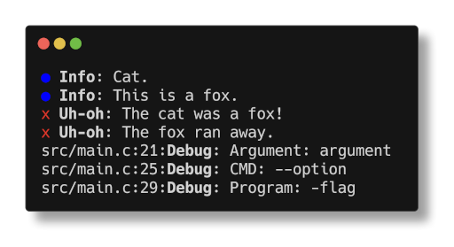
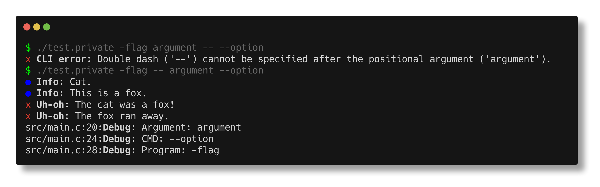

<p align="center">
    <h1 align="center">cli.h</h1>
    <p align="center">
        Stb-style library for handling the command line.
        <a href="#examples"></a>
    </p>
</p>

## Getting started

To use `cli.h`, define `CLI_IMPLEMENTATION` and include the header in your application. To configure the behaviour and dependency of the library additional macros can be defined:

| Macro | Default value | Description |
|-------|:-------------:|-------------|
| `CLI_NO_STDIO_H` | - | Do not include `<stdio.h>` (but `fprintf()` is still expected to be defined). |
| `CLI_NO_STDBOOL_H` | - | Do not use `<stdbool.h>`. |
| `CLI_NO_STYLES` | - | Do not use colors and other styles for formatting output. |
| `CLI_NOHEAP` <br> `CLI_NOHEAP_IMPLEMENTATION` | - | Do not allocate arguments on the heap. For more information, see [Using stack](#using-stack). |
| `CLI_DEFAULT_ARR_CAP` | `5` | Default capacity for dynamic arrays (e.g. `CliArray`). |
| `CLI_ASSERT` | `assert` | An assert function. If not defined, `assert()` from `<assert.h>` is used. |
| `CLI_MALLOC` | `malloc` | A function for allocating memory. If not defined, `malloc()` from `<stdlib.h>` is used. |
| `CLI_REALLOC` | `realloc` | A function for reallocating memory. If not defined, `realloc()` from `<stdlib.h>` is used. |
| `CLI_FREE` | `free` | A function for freeing memory. If not defined, `free()` from `<stdlib.h>` is used. |
| `CLI_ERROR_SYM` | `"✖"` | A symbol to use in error messages. By default, it is a Unicode  'x' that may be unsupported by a terminal font. |
| `CLI_INFO_SYM` | `"●"` | A symbol to use in information messages. By default, it is a Unicode circle that may be unsupported by a terminal font. |

**Please note** that options provided **after** the positional arguments are considered **cmd_options**, not program_options.

For example, for `./program --option=1 -flag2 argument --modifier`:
 * `./program` is stored in `Cli.execfile`;
 * `--option=1 -flag` are stored in `Cli.program_options`;
 * `argument` is stored in `Cli.args`;
 * And finally, `--modifier` is stored in `Cli.cmd_options`.

### Double dash (`--`)

Whenever double dash is encountered, `cli.h` considers all following options as **cmd_options**.
However, double dash should be used prior to the positional arguments.



## Using stack

> **[Example](#example-noheap)**

It is possible to use `cli.h` without allocating `CliArray.data` on the heap. For that, `CLI_NOHEAP` and/or `CLI_NOHEAP_IMPLEMENTATION` should be used.

Similarly to `CLI_IMPLEMENTATION`, `CLI_NOHEAP_IMPLEMENTATION` provides the implementation for `CLI_NOHEAP`.
If `CLI_NOHEAP_IMPLEMENTATION` is defined, `#define CLI_NOHEAP` is optional and does not affect the behaviour.

**When using stack, make sure that:**

 * `cli_parse_noheap(int argc, char** argv, struct Cli* cli, const char** stack)` is called instead of `cli_parse(...)`
 * The `capacity` and `next_unused` fields of `CliArray` are not used

## Examples

```c
#define CLI_IMPLEMENTATION
#include "cli.h"

int main(int argc, char** argv) {
    Cli cli;

    cli_toggle_styles(); // Use ANSI escape sequences
    int exit_code = cli_parse(argc, argv, &cli);
    if (exit_code) {
        return exit_code;
    }

    cli_print_info("Info", "Cat.");
    cli_printf_info("Info", "This is %s.", "a fox");

    cli_print_error("Uh-oh", "The cat was a fox!");
    cli_printf_error("Uh-oh", "The fox %s.", "ran away");

    for (unsigned short i = 0; i < cli.args.length; i++) {
        cli_printf_debug("Argument: %s", cli.args.data[i]);
    }
    for (unsigned short i = 0; i < cli.cmd_options.length; i++) {
        cli_printf_debug("CMD: %s", cli.cmd_options.data[i]);
    }
    for (unsigned short i = 0; i < cli.program_options.length; i++) {
        cli_printf_debug("Program: %s", cli.program_options.data[i]);
    }
    cli_free(&cli);
}
```

<a name="example-noheap"></a>

```diff
+#define CLI_NOHEAP_IMPLEMENTATION
 #define CLI_IMPLEMENTATION
 #include "cli.h"

 int main(int argc, char** argv) {
+    const char* stack[argc];
     Cli cli;

     cli_toggle_styles(); // Use ANSI escape sequences
-    int exit_code = cli_parse(argc, argv, &cli);
+    int exit_code = cli_parse_noheap(argc, argv, &cli, stack);
     if (exit_code) {
         return exit_code;
     }

     for (unsigned short i = 0; i < cli.args.length; i++) {
         cli_printf_debug("Argument: %s", cli.args.data[i]);
     }
     for (unsigned short i = 0; i < cli.cmd_options.length; i++) {
         cli_printf_debug("CMD: %s", cli.cmd_options.data[i]);
     }
     for (unsigned short i = 0; i < cli.program_options.length; i++) {
         cli_printf_debug("Program: %s", cli.program_options.data[i]);
     }
-    cli_free(&cli);
 }
```
